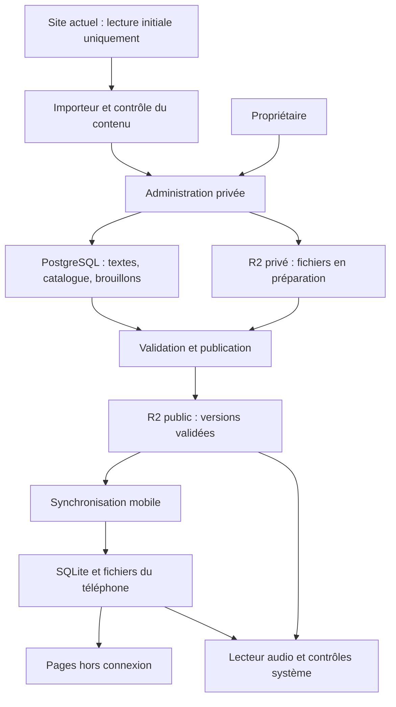

# Perles Divines — Cahier technique pour le développement assisté par IA

Version 1.0 — 15 septembre 2026  
Destinataires : Codex, Cursor ou un développeur reprenant le projet.  
Site de référence : https://www.perlesdivines.fr/sommaire.html

## 1. Objet et mode d’emploi

Développer une application Android et iOS reprenant l’intégralité du contenu public du site Perles Divines et son identité visuelle, en ajoutant une bibliothèque d’environ 500 MP3 et un lecteur audio complet. L’application doit fonctionner hors connexion pour les pages téléchargées et les audios choisis par l’utilisateur. Une administration privée permet au propriétaire de modifier les textes et de publier des audios sans développeur.

Ce document est une spécification à réaliser, pas un compte rendu d’une application déjà développée. Il distingue les exigences exprimées par le propriétaire, les constats de navigation et les choix techniques recommandés. Les choix détaillés et valeurs par défaut proposés ici peuvent être ajustés pour une raison documentée, sans réduire le périmètre demandé.

Lire ce fichier intégralement avant de modifier le projet. Utiliser le fichier compagnon `PROMPT_DEMARRAGE_CODEX_CURSOR.md` pour démarrer le travail. Maintenir ensuite un suivi des exigences, des décisions et des vérifications dans le dépôt.

### Principes impératifs

- Ne modifier aucun fichier, contenu, service ou réglage du site existant. Le site sert uniquement de source initiale en lecture.
- Ne pas redemander de validation de propriété ni imposer une archive ZIP : le propriétaire a confirmé les droits et les accès, et autorise la récupération des ressources publiques en ligne.
- Après l’import initial, les contenus de l’application évoluent séparément. Aucun écrasement automatique depuis le site.
- Préserver les textes religieux, l’arabe, la translittération, la traduction, les images, les références et les dédicaces. Ne pas paraphraser, compléter ou « corriger » leur contenu avec une IA sans instruction explicite.
- Fournir de vraies fonctions mobiles et audio. Une simple ouverture du site dans une application ne satisfait pas la demande.
- Livrer Android ET iOS. Une première version Android est une étape, pas la fin du projet.
- Ne pas annoncer une fonction comme validée sans préciser les tests réellement effectués.

## 2. Exigences confirmées par le propriétaire

| ID | Exigence de la version complète |
|---|---|
| E01 | Reprendre tout le site public, avec son apparence actuelle adaptée aux écrans mobiles. |
| E02 | Application publique, interface en français, distribution mondiale souhaitée. |
| E03 | Prévoir environ 300 utilisateurs au départ ; estimation incertaine, pas une limite technique. |
| E04 | Ajouter une rubrique « Audios », seule nouvelle rubrique éditoriale demandée à ce stade. |
| E05 | Environ 500 MP3 disponibles sur l’ordinateur du propriétaire ; droits de diffusion et d’export confirmés. |
| E06 | Téléchargement d’un audio, d’une collection ou de tout le catalogue, au choix de l’utilisateur. |
| E07 | Textes et pages disponibles automatiquement hors connexion après une première synchronisation réussie. |
| E08 | Autoriser l’export des fichiers audio téléchargés hors de l’application. |
| E09 | Lecture audio en arrière-plan et écran verrouillé. |
| E10 | Reprise de position, enchaînement, listes de lecture, favoris, vitesse et minuterie d’arrêt. |
| E11 | Commandes audio sur l’écran verrouillé et depuis les écouteurs. |
| E12 | Recherche rapide et filtres par auteur, thème et collection. |
| E13 | Administration simple pour ajouter les audios et modifier les textes de l’application. |
| E14 | Les nouvelles publications apparaissent à la prochaine synchronisation avec connexion. |
| E15 | Application entièrement gratuite ; aucun achat, don, abonnement ou publicité. |
| E16 | Aucun compte pour les utilisateurs de l’application. |
| E17 | Aucune notification de nouveau contenu et aucune statistique d’écoute demandée. |
| E18 | Aucun changement sur le site ; administration et contenus de l’application indépendants. |
| E19 | Publication sous l’identité de l’éditeur désigné par le propriétaire, établi à La Réunion. Les formalités de propriété sont considérées réglées. |
| E20 | Développement avec une IA et le propriétaire ; budget à définir, aucune échéance fixe. |
| E21 | Le propriétaire dispose d’un téléphone Android pour les essais. Pas d’iPhone confirmé. |

Les comptes développeur Apple et Google ne sont pas encore créés. Les MP3 sont déjà organisés conceptuellement par thème, auteur et collection, mais aucun tableau de métadonnées n’existe. Taille totale, durées et emplacement local exact des MP3 restent à mesurer.

### Hors périmètre de la première version

CarPlay, Android Auto, interface voiture dédiée, AirPlay, Chromecast, synchronisation entre appareils, comptes publics, paiements, publicités, réseau social, notifications éditoriales, statistiques d’écoute et nouvelle édition du site web. Ne pas ajouter de fonction d’IA dans l’application elle-même.

Les contrôles système nécessaires à la lecture et, selon le système, au transfert d’un fichier restent autorisés : ce ne sont pas des notifications de nouveau contenu. Ne pas intégrer de service de notifications push.

## 3. Repérage du site existant

Navigation effectuée le 14 septembre 2026 dans le navigateur. Ce repérage couvre les principales rubriques et une page de lecture ; il ne constitue pas encore un inventaire exhaustif des fichiers ni une validation du fonctionnement PWA hors ligne.

| URL observée | Contenu ou comportement repéré |
|---|---|
| [sommaire.html](https://www.perlesdivines.fr/sommaire.html) | Logo, identité verte et blanche, menu de rubriques, historique et À propos. |
| [quran.html](https://www.perlesdivines.fr/quran.html) | Liste de sourates et Ayat al-Kursî. |
| [namaz.html](https://www.perlesdivines.fr/namaz.html) | Liste de prières. |
| [doua.html](https://www.perlesdivines.fr/doua.html) | Liste d’invocations. |
| [zyaraate.html](https://www.perlesdivines.fr/zyaraate.html) | Visites et contenus organisés notamment par jour. |
| [specifique.html](https://www.perlesdivines.fr/specifique.html) | Aamal spécifique. |
| [aamal.html](https://www.perlesdivines.fr/aamal.html) | Sous-rubriques par mois. |
| [fr/fateha.html](https://www.perlesdivines.fr/fr/fateha.html) | Arabe visible, translittération, traduction, informations, ancres et barre supérieure de navigation/progression. |
| [tafsir.html](https://www.perlesdivines.fr/tafsir.html) | Oriente vers des ressources de The Academy For Learning Islam. |
| [diapo-coran.html](https://www.perlesdivines.fr/diapo-coran.html) | Oriente vers un autre site proposant un diaporama du Coran. |
| [a-propos.html](https://www.perlesdivines.fr/a-propos.html) | Présentation, dédicaces, sources et contact par courriel. |

Sur les pages parcourues, aucun compte utilisateur, formulaire interactif ou lecteur audio intégré n’a été rencontré. Cela ne prouve pas leur absence de toutes les pages : l’import doit aussi inventorier les éléments interactifs.

Le propriétaire indique une base HTML/CSS. L’audit technique doit aussi rechercher les images, polices, scripts, feuilles de style imbriquées, éventuel manifeste PWA et éventuel service worker. Certains éléments arabes peuvent être des images : déterminer leur nature dans le code récupéré et préserver l’original. Ne pas lancer d’OCR de substitution.

Pour Tafsir et Diaporama : importer les pages de présentation appartenant au site. Les ressources d’autres domaines restent des destinations externes nécessitant Internet. L’import de l’intégralité de sites tiers n’est pas demandé. Cette limite doit être visible dans l’application, sans prétendre que ces ressources sont disponibles hors connexion.

## 4. Architecture recommandée

### 4.1 Choix mobile : Flutter avec services audio natifs

Retenir Flutter/Dart pour une base de code Android/iOS commune. Réaliser la navigation, le catalogue, le lecteur et les téléchargements en Flutter ; afficher les pages éditoriales importées dans une vue HTML locale contrôlée. Le lecteur doit utiliser les fonctions audio du système, indépendamment de la vue HTML.

Flutter produit des applications compilées et permet l’intégration aux fonctions des plateformes. Ses widgets sont rendus par Flutter : il ne s’agit pas d’une réécriture séparée en widgets SwiftUI et Jetpack Compose. [Architecture officielle Flutter](https://docs.flutter.dev/resources/architectural-overview)

| Approche | Appréciation pour ce projet |
|---|---|
| Flutter + lecture HTML locale | Recommandée : code partagé, interface audio dédiée, conservation du contenu HTML et accès aux fonctions du téléphone. |
| React Native + lecture HTML locale | Alternative valable, notamment si le futur mainteneur maîtrise déjà React Native. Aucun avantage décisif établi ici. |
| Capacitor et adaptation de la PWA | Réutilisation web potentiellement plus rapide, mais nécessite aussi une intégration native sérieuse pour l’audio et les gros transferts. Pas retenu comme base par défaut. |
| Swift et Kotlin séparément | Contrôle maximal, mais deux applications à maintenir ; effort peu justifié par le volume et le périmètre actuels. |

Cette comparaison est une appréciation de conception pour ce projet, pas un benchmark mesuré ni un devis.

### 4.2 Composants retenus

| Partie | Technologie recommandée | Responsabilité |
|---|---|---|
| Application mobile | Flutter stable / Dart | Android et iOS, interface française. |
| État et navigation | Riverpod et go_router | États testables et navigation structurée ; versions compatibles à verrouiller. |
| Lecteur | just_audio | Sources MP3 distantes et locales, position, vitesse et séquence. |
| Intégration système | audio_service + audio_session | Session audio, commandes système et interruptions. |
| Transferts | background_downloader | Transferts persistants utilisant les mécanismes des plateformes. |
| Base locale | SQLite avec Drift | Catalogue, téléchargements, favoris, listes et positions. |
| Pages éditoriales | webview_flutter | Rendu du contenu HTML installé localement. |
| Administration | Next.js / React / TypeScript | Interface privée en français et API d’administration. |
| Métadonnées serveur | Supabase PostgreSQL | Contenus, collections, brouillons, versions et tâches. |
| Connexion administrateur | Supabase Auth | Compte privé du propriétaire ; aucune inscription publique. |
| Fichiers | Cloudflare R2 Standard | MP3, images, contenus publiés et manifestes. |
| Travaux serveur | Processus Node.js durable | Validation des médias et fabrication des publications ; même dépôt que l’administration. |
| Livraison publique | HTTPS sur stockage/CDN | Lecture des manifestes et médias sans compte. |

Références des composants : [just_audio](https://pub.dev/packages/just_audio), [audio_service](https://pub.dev/packages/audio_service), [audio_session](https://pub.dev/packages/audio_session), [background_downloader](https://pub.dev/packages/background_downloader), [Drift](https://pub.dev/documentation/drift/latest/native/), [webview_flutter](https://pub.dev/packages/webview_flutter).

Ne pas cumuler plusieurs moteurs de lecture ou de téléchargement. Encapsuler ces dépendances derrière des interfaces afin de pouvoir remplacer un plugin sans refaire l’application.

### 4.3 Circulation des données



La lecture de contenus déjà publiés ne doit pas dépendre de la disponibilité de l’administration ni d’une session Supabase. L’application consulte un manifeste public versionné et des fichiers HTTPS. Les lectures audio ne transitent pas par les petites fonctions de l’administration.

Ne pas héberger l’administration dans les fichiers du site existant. Choisir une adresse fournie par l’hébergeur ou un domaine séparé. Un éventuel ajout DNS devra être traité séparément et ne doit pas être nécessaire pour commencer localement.

## 5. Import du site et conservation de l’apparence

### 5.1 Import reproductible

Créer un outil d’import en lecture seule, avec comme point de départ `https://www.perlesdivines.fr/sommaire.html`. Il suit les liens internes, complète avec la page d’accueil, l’historique et les ressources effectivement référencées. Une arborescence trouvée dans un sitemap peut compléter l’inventaire ; ne pas prétendre retrouver des fichiers publics orphelins jamais référencés.

Comportements imposés :

1. Limiter le parcours aux hôtes explicitement autorisés du site. Classer séparément les destinations externes.
2. Normaliser les URL, séparer fragment et chemin, éviter les boucles et les doublons, respecter la casse des chemins.
3. Télécharger avec une concurrence modérée, par exemple deux requêtes simultanées, délais et reprises bornées.
4. Conserver les octets sources et détecter correctement l’encodage avant conversion UTF-8. Ne pas produire de caractères accentués corrompus.
5. Capturer les dépendances HTML/CSS : images, `srcset`, `url()`, `@import`, polices, fichiers liés et ressources nécessaires au rendu.
6. Produire `source-inventory.json` : URL, statut HTTP, type MIME, taille, empreinte SHA-256, chemin local, date et dépendances.
7. Produire un rapport des liens cassés, ressources manquantes et éléments interactifs. Ne pas masquer une page absente derrière un écran vide.
8. Conserver un exemplaire brut immuable et un exemplaire normalisé destiné à l’application.
9. Réécrire les liens internes vers les identifiants locaux des pages, en conservant les ancres.
10. Après le premier import approuvé visuellement, ne plus réimporter automatiquement par-dessus les textes administrés.

### 5.2 Adaptation mobile

Conserver le logo fourni par le site, le vert, le blanc, les ornements et l’ordre logique des rubriques. Extraire les couleurs et ressources réelles lors de l’audit ; ne pas inventer un nouveau logo ou une charte éloignée.

Adapter les largeurs, marges, espacements et zones tactiles. Cible : écrans de 320 à 430 points logiques sans débordement horizontal général. Les images arabes doivent être proportionnelles et consultables en agrandissement si leur lisibilité l’exige. Garder `dir="rtl"` et `lang="ar"` pour les passages arabes textuels.

La navigation native remplace les commandes web devenues redondantes. Une seule barre de navigation est affichée. Conserver les raccourcis Traduction, Translittération, Informations et la progression de lecture lorsqu’ils existent dans la page source.

Comparer visuellement au moins le sommaire, une liste, une page arabe/française longue, une page avec tableau et À propos. L’objectif est la fidélité du contenu et de l’identité, avec une utilisation mobile confortable.

### 5.3 Rendu HTML local

Installer les pages et leurs ressources dans un répertoire privé versionné de l’application. Toutes leurs dépendances doivent se résoudre localement ; une page ne peut être déclarée hors ligne si ses images dépendent encore du réseau.

Le contenu éditorial téléchargé contient uniquement des données et du HTML/CSS nettoyé. Retirer les scripts hérités, service workers, formulaires actifs et gestionnaires JavaScript incorporés après avoir relevé leur rôle. Reproduire les fonctions utiles par du code contrôlé embarqué dans l’application.

Utiliser le chargement de fichiers locaux officiellement supporté par les plugins de plateforme, avec accès restreint au répertoire de lecture. Ne pas activer l’accès universel aux fichiers ou au réseau pour les pages. Tester aussi les sous-ressources : l’interception des seules navigations ne suffit pas. Une éventuelle passerelle de messages doit accepter seulement des événements structurés de navigation/progression ; elle ne peut ni exécuter du code arbitraire ni accéder aux secrets.

La vue HTML ne doit pas charger le site vivant pour afficher le contenu principal. Les liens externes s’ouvrent dans le navigateur du téléphone après action de l’utilisateur ; hors ligne, afficher un message clair. Le lien de contact ouvre l’application courriel, sans envoyer de message automatiquement.

## 6. Parcours et écrans mobiles

Navigation proposée : **Sommaire**, **Audios**, **Ma bibliothèque**, **Réglages**. Les deux derniers sont des espaces utilitaires, pas de nouvelles rubriques éditoriales.

| Écran | Comportement attendu |
|---|---|
| Sommaire | Rubriques et identité du site, état de préparation hors ligne discret. |
| Liste de textes | Titres existants, navigation hiérarchique, retour conservé. |
| Lecture d’un texte | HTML local, images, ancres, progression ; lien vers un audio seulement si l’association est renseignée. |
| Catalogue audio | Recherche, filtres, accès aux collections, titre et auteur, durée et état de téléchargement. |
| Collection | Description, pistes ordonnées, lire la collection et télécharger la collection. |
| Fiche audio | Titre, auteur, description, thèmes, collections, lecture, favori, téléchargement et export si disponible. |
| Lecteur complet | Progression, durée, lecture/pause, précédent/suivant, sauts de 15 secondes, vitesse, minuterie, file de lecture. |
| Mini-lecteur | Titre, lecture/pause, ouverture du lecteur ; reste présent pendant la navigation. |
| Ma bibliothèque | Téléchargements, favoris et listes personnelles. |
| Gestion du stockage | Espace utilisé, transferts, suppression locale d’un fichier/d’une collection/de tous les audios. |
| Réglages | Wi-Fi uniquement, vitesse, synchronisation manuelle, aide, À propos, confidentialité et version. |

Valeurs par défaut proposées : vitesse 1×, reprises activées, téléchargement audio uniquement après demande, transferts audio en Wi-Fi uniquement avec possibilité explicite d’autoriser les données mobiles. Les téléchargements de textes démarrent automatiquement avec progression ; ne pas imposer un écran d’inscription.

Première installation sans Internet : afficher le sommaire de secours embarqué et expliquer que les contenus doivent d’abord être préparés. Ne pas simuler une bibliothèque pleine. Une édition initiale des textes peut être embarquée ultérieurement si son poids mesuré le justifie, mais ce n’est pas une condition demandée.

Toutes les actions doivent avoir des états de chargement, succès, absence de contenu et erreur en français. Aucun bouton factice ni contenu de démonstration dans la version de production.

## 7. Spécification du lecteur audio

### 7.1 Responsabilités

Créer un seul `AudioController`/`AudioHandler` pour toute l’application. Il possède le moteur de lecture, la file, la position, la vitesse, la minuterie et les métadonnées système. Les écrans observent cet état et lui envoient des commandes. La fermeture d’un écran ne doit pas détruire le lecteur.

Lire en priorité le fichier local validé. Sinon, proposer une lecture en ligne par HTTPS. Un flux écouté en ligne n’est pas automatiquement marqué comme téléchargé. L’écoute ne doit pas charger tout le MP3 en mémoire.

### 7.2 Règles fonctionnelles

- Lecture/pause, déplacement précis, piste précédente/suivante et sauts de ±15 secondes.
- Enchaînement dans l’ordre de la collection ou de la liste sélectionnée.
- File temporaire distincte des listes personnelles enregistrées.
- Listes personnelles : créer, renommer, ajouter/enlever une piste, réordonner et supprimer.
- Favoris persistants par identifiant audio stable.
- Vitesse proposée : 0,75×, 1×, 1,25×, 1,5×, 1,75×, 2× ; conservation de la préférence et hauteur de voix naturelle lorsque le moteur le permet.
- Minuterie : 15, 30, 45 ou 60 minutes, durée personnalisée et arrêt à la fin de la piste.
- La minuterie appartient au service de lecture, jamais uniquement au composant visuel. Utiliser une référence de temps robuste et vérifier l’échéance après chaque reprise du service.
- Sauvegarder la position au moins toutes les cinq secondes pendant la lecture, et à chaque pause, déplacement, changement de piste ou interruption connue.
- Restaurer la position après fermeture/réouverture sans démarrer automatiquement le son. Une lecture entièrement terminée recommence à zéro lors d’une nouvelle demande explicite.
- Conserver les états sur disque ; ne pas dépendre uniquement d’un événement de fermeture que le système peut ne jamais envoyer.
- Si une piste de la file est indisponible hors ligne, informer et passer à la suivante disponible, sans boucle ; si aucune ne l’est, arrêter avec explication.

### 7.3 Intégration Android et iOS

L’implémentation via `audio_service` doit connecter les commandes de l’application et du système au même état. Configuration Android : service de lecture en premier plan, déclaration du type et des permissions adaptés à la version Android ciblée. Afficher titre, auteur, durée, position et commandes dans les contrôles média. La documentation Android décrit la séparation de la session/du lecteur du cycle de vie de l’écran. [Lecture en arrière-plan Android](https://developer.android.com/media/media3/session/background-playback)

Configurer sur iOS la session pour la lecture, le mode audio en arrière-plan et les commandes de l’écran verrouillé via les plugins. Référence d’intégration : [audio_service](https://pub.dev/packages/audio_service).

Gérer les appels, la perte de priorité audio, la déconnexion des écouteurs et les changements de sortie. Par défaut, mettre en pause lors d’une déconnexion des écouteurs. Ne reprendre après une interruption que si le système l’autorise et si l’utilisateur n’a pas demandé une pause entre-temps.

Exigence : lecture continue quand l’écran est verrouillé ou qu’une autre application passe au premier plan. Ne pas promettre de lecture après arrêt forcé, extinction ou redémarrage du téléphone. Tester et documenter séparément le retrait depuis les applications récentes et l’arrêt forcé.

## 8. Téléchargements, stockage et export

### 8.1 File durable

Télécharger un audio, une collection ou tout le catalogue signifie ajouter les fichiers manquants à une file persistante. Dédupliquer par identifiant et version de fichier ; « Tout télécharger » lancé deux fois ne crée pas deux copies.

Valeurs de conception : trois transferts audio simultanés maximum, limite configurable ; prioritisation d’un téléchargement individuel demandé ensuite. Pour 500 pistes, conserver la file complète en base et alimenter les tâches système de façon bornée. Un lot correspond à un instantané du catalogue ; les pistes publiées plus tard ne sont pas ajoutées silencieusement au lot.

`background_downloader` s’appuie sur des mécanismes système et fournit un suivi persistant. Ses contraintes de durée et de relance varient selon Android/iOS : vérifier la version retenue et tester les longues files sur appareils. Aucun plugin ne supprime les restrictions liées à un arrêt forcé par l’utilisateur. [Documentation du plugin](https://pub.dev/packages/background_downloader)

### 8.2 États et intégrité

États métier : `notDownloaded`, `queued`, `downloading`, `paused`, `waitingForNetwork`, `verifying`, `downloaded`, `failed`, `cancelled`. Associer les états réels du plugin à ce modèle ; ne pas supposer une équivalence parfaite.

- Afficher progression en octets et progression globale du lot pondérée par les tailles.
- Avant un lot, afficher le nombre de fichiers manquants, leur poids et l’espace disponible.
- Télécharger dans un fichier temporaire puis contrôler longueur et SHA-256 avant renommage atomique vers son emplacement final.
- Prévoir une marge de stockage pour les fichiers temporaires et pour la coexistence des versions lors d’une mise à jour. Recontrôler l’espace au fil des transferts.
- Persister les identifiants des tâches système, les tentatives et les erreurs utiles.
- À chaque lancement, réconcilier base métier, état du moteur de transfert et fichiers réellement présents.
- Reprendre les téléchargements partiels lorsque le serveur et le système le permettent. Si la reprise échoue, recommencer proprement le fichier, sans le marquer comme complet.
- Réessayer les erreurs réseau temporaires avec délais croissants et nombre de tentatives borné. Une erreur définitive, par exemple fichier absent, reste visible et relançable.
- Une URL ou une version de média remplacée pendant le transfert ne doit jamais mélanger des fragments de fichiers différents.

Pause/reprise/cancel doivent agir sur le vrai transfert, pas seulement sur son affichage. L’utilisateur peut annuler un lot tout en conservant ses fichiers déjà terminés.

### 8.3 Emplacements et suppression

Stocker les MP3 explicitement téléchargés dans un répertoire persistant privé de l’application, hors cache temporaire. Conserver des chemins relatifs : les chemins racines peuvent changer, notamment sur iOS. Exclure les médias retéléchargeables des sauvegardes automatiques du téléphone lorsque possible.

Ne jamais purger automatiquement les MP3 téléchargés pour libérer du cache. La suppression locale enlève les fichiers choisis, mais conserve favoris, listes et métadonnées du catalogue. Si le fichier est en cours de lecture, différer sa suppression jusqu’à la libération par le lecteur, ou arrêter après une action explicite de l’utilisateur.

Un MP3 incomplet n’est ni lisible comme fichier hors ligne, ni exportable. Un MP3 corrompu repasse en erreur avec une action de téléchargement.

### 8.4 Export

Version initiale : export d’un MP3 à la fois depuis sa fiche ou la liste des téléchargements. Utiliser le partage système et/ou l’enregistrement vers une destination choisie : fournisseur de fichiers/Downloads côté Android, partage/Enregistrer dans Fichiers côté iOS. Les permissions doivent correspondre à ce mécanisme, sans demander un accès général à tous les fichiers du téléphone.

Copier le MP3 validé avec un nom de fichier nettoyé et l’extension `.mp3`. Ne pas recomprimer ni modifier les octets de l’original. Les copies exportées deviennent indépendantes : supprimer le téléchargement dans l’application ne les supprime pas. Les fichiers privés de l’application sont normalement perdus lors d’une désinstallation ; les copies exportées ailleurs peuvent subsister.

L’export massif en ZIP n’est pas requis pour satisfaire la demande initiale. L’architecture doit permettre de l’ajouter ultérieurement sans changer le stockage.

## 9. Modèle de données

### 9.1 Conventions

Identifiants stables UUID, dates serveur en UTC au format ISO 8601, tailles en octets, durées et positions en millisecondes. Séparer la version du contenu, la version du fichier audio et la version du schéma de synchronisation. Un changement de titre ne doit pas forcer le téléchargement du même MP3.

Les titres affichés conservent leurs accents. Les variantes de recherche sont calculées séparément. Une piste peut appartenir à plusieurs collections et plusieurs thèmes. Une association facultative lie une piste à une page du site importée ; ne jamais la déduire définitivement sans validation éditoriale.

### 9.2 Base serveur proposée

| Table | Champs principaux et contraintes |
|---|---|
| `admin_members` | `user_id` lié à Supabase Auth, rôle, actif ; affectation uniquement par un processus privilégié. |
| `sections` | `id`, `parent_id` nullable, titre, ordre, statut ; aucun cycle dans la hiérarchie. |
| `pages` | `id`, section, titre, URL source nullable, slug unique, ordre, `current_draft_revision_id`. |
| `page_revisions` | `id`, `page_id`, numéro, blocs/HTML normalisé, références de ressources, auteur admin, date ; historique immuable. |
| `authors` | `id`, nom affiché, description facultative ; réutilisable entre pistes. |
| `themes` | `id`, nom, ordre. |
| `collections` | `id`, titre, description, illustration facultative, ordre, statut. |
| `audio_tracks` | `id`, titre, description, auteur principal nullable en brouillon, statut, fichier courant, version éditoriale. |
| `audio_authors` | Piste, auteur, rôle et ordre si plusieurs intervenants sont nécessaires. |
| `audio_themes` | Piste et thème ; paire unique. |
| `collection_tracks` | Collection, piste, ordre ; paire unique. |
| `audio_page_links` | Piste et page ; liens éditoriaux facultatifs. |
| `media_assets` | `id`, clé de stockage, MIME, taille, SHA-256, durée éventuelle, version, état de validation, date. |
| `uploads` | Session d’import, fichier attendu, clé temporaire, état, erreur et dates. |
| `jobs` | Type, paramètres, état, essais, verrou/expiration, clé d’idempotence, résultat ; travaux durables. |
| `releases` | Numéro global croissant, révisions sélectionnées, manifeste, état, dates, auteur, référence du retour arrière éventuel. |
| `publication_state` | Ligne unique pointant vers la publication servie ; contrôle de concurrence. |
| `audit_events` | Actions d’administration utiles : modification, publication, restauration, archivage ; pas d’événements d’écoute. |

Statuts éditoriaux : `draft`, `ready`, `published`, `archived`. Un brouillon reste privé. La publication utilise un instantané de révisions, et non une lecture mouvante des brouillons pendant la fabrication du manifeste.

### 9.3 Base locale du téléphone

| Table | Usage |
|---|---|
| `catalog_*` | Copie locale des pages, auteurs, thèmes, collections, pistes et relations publiés. |
| `downloads` | Piste/version, identifiant de tâche, chemin relatif, taille, progression, état, erreur. |
| `download_batches` | Lot individuel/collection/global, liste figée de pistes, état et date. |
| `favorites` | Identifiant audio et date ; indépendant du remplacement de catalogue. |
| `playlists` / `playlist_items` | Listes locales et ordre des pistes. |
| `playback_positions` | Piste, version du média, position, terminé, date. |
| `playback_queue` | File en cours et index restaurables. |
| `reader_positions` | Page, révision, ancre et progression ; restauration au mieux si le texte change. |
| `settings` | Vitesse, Wi-Fi uniquement et préférences locales. |
| `sync_state` | Version installée, version détectée, date, erreur et travail en préparation. |

Les mises à jour de catalogue ne doivent pas faire de suppression en cascade dans les favoris ou les listes personnelles. Conserver un libellé de secours pour une piste archivée. Après remplacement d’un média, ne réutiliser sa position que si elle reste cohérente avec la nouvelle durée ; sinon repartir à zéro avec une information discrète.

L’absence de compte signifie que favoris, positions et listes ne sont pas synchronisés entre appareils. Ne pas présenter ces données comme sauvegardées sur un serveur. Leur export/sauvegarde manuelle n’est pas une fonction obligatoire de cette version.

## 10. Catalogue public et synchronisation

### 10.1 Contrat des publications

Publier des objets immuables à des chemins versionnés et un petit pointeur `latest.json`. Exemple de structure à implémenter, avec URL et empreinte fictives non utilisables en production :

```json
{
  "schemaVersion": 1,
  "releaseVersion": 1,
  "publishedAt": "2026-09-15T08:00:00Z",
  "manifest": {
    "url": "https://media.example.invalid/releases/1/manifest.json",
    "sha256": "REMPLACER_PAR_64_CARACTERES_HEXADECIMAUX",
    "sizeBytes": 12345
  }
}
```

Le manifeste contient : version du schéma, version de publication, date, sections, auteurs, thèmes, collections, pistes, pages, relations, références des médias et liste des identifiants retirés. Les références de chaque fichier comportent URL ou chemin résolu sur une base HTTPS autorisée, taille, MIME et empreinte SHA-256. Les audios comportent aussi leur durée et leur version de fichier.

Pour chaque page, référencer un paquet contenant le HTML, ses ressources et un inventaire interne. Réutiliser les paquets inchangés entre publications. Éviter de retélécharger l’ensemble des textes pour une modification d’une seule page. Des ressources communes versionnées peuvent être partagées si la résolution locale reste déterministe.

Créer un JSON Schema validé en TypeScript et en Dart, des exemples valides et invalides et des tests de compatibilité. Les valeurs fictives de l’exemple ci-dessus doivent être refusées en production. Définir des limites de taille et de nombre d’éléments pour éviter les imports illimités.

### 10.2 Publication atomique côté serveur

1. L’administrateur demande la publication ; le serveur vérifie rôle, données et versions attendues.
2. Créer une tâche persistante et un instantané éditorial dans une transaction.
3. Le worker réserve le travail avec un verrou à durée limitée ; les reprises sont idempotentes.
4. Préparer et vérifier toutes les ressources nécessaires dans le stockage de publication.
5. Vérifier les liens, les tailles, les empreintes et la compatibilité du manifeste.
6. Déposer le manifeste immuable, puis mettre à jour `latest.json` en dernier.
7. Marquer la publication active en base et enregistrer son numéro.
8. En cas de crash entre les étapes 6 et 7, le worker compare le pointeur public et les données de la tâche, puis réconcilie l’état. Ne pas supposer une transaction unique entre PostgreSQL et le stockage objet.

Sérialiser les publications afin que deux clics concurrents ne remplacent pas une version récente par une ancienne. Les ressources historiques ne sont pas effacées pendant la publication. Un retour arrière crée un nouveau numéro global qui référence les anciens contenus validés ; la numérotation reste croissante.

Politique de cache proposée : objets immuables avec cache long ; `latest.json` revalidable par ETag et fraîcheur courte, au plus 60 secondes. Une réponse 304 évite les téléchargements inutiles.

### 10.3 Installation atomique sur le téléphone

Au démarrage et au retour au premier plan, contrôler les mises à jour si la connexion existe, avec limitation à un contrôle automatique toutes les quinze minutes. Le bouton « Actualiser » force un contrôle. Une application ouverte à la prochaine connexion doit pouvoir découvrir les nouveautés sans mise à jour du store. Ne pas promettre une synchronisation immédiate pendant une fermeture prolongée de l’application.

Procédure :

1. Ouvrir immédiatement la version locale disponible, sans attendre le réseau.
2. Récupérer `latest.json`, puis le manifeste si une nouvelle version est proposée.
3. Valider schéma, domaines, tailles, empreinte et références.
4. Télécharger les nouveaux paquets de textes/images vers un espace de préparation. Les nouveaux MP3 sont seulement ajoutés au catalogue.
5. Vérifier chaque paquet avant extraction. Refuser les chemins absolus, `..`, liens symboliques et décompressions dépassant les limites prévues.
6. Préparer l’index local et vérifier les liens des pages. Les fichiers doivent être prêts avant de basculer la base.
7. Dans une transaction SQLite, activer la nouvelle version du catalogue et le pointeur de répertoire de contenu ; préserver les données personnelles locales.
8. Supprimer ultérieurement les anciennes ressources non utilisées. Conserver l’ancienne version tant qu’un lecteur l’utilise ou qu’une installation n’est pas confirmée.

Une coupure réseau ou une fermeture à n’importe quelle étape laisse l’ancienne version lisible. Au premier lancement, afficher la préparation et son avancement ; annoncer « Disponible hors connexion » uniquement après contrôle réussi. La transaction ne doit jamais référencer des fichiers encore temporaires.

Les SHA-256 assurent l’intégrité des fichiers par rapport au manifeste. Ils ne constituent pas une signature indépendante : la confiance initiale repose sur HTTPS, les domaines autorisés et les accès de publication. Ne pas prétendre que l’empreinte seule empêche un serveur compromis de publier du contenu modifié.

### 10.4 Retraits et remplacement de médias

Archiver une piste la retire des nouvelles listes publiques. Conserver les entrées personnelles et les fichiers locaux déjà téléchargés, avec statut « Retiré du catalogue » si nécessaire. Un retrait ne peut pas effacer les exports déjà réalisés par les utilisateurs ; aucune révocation à distance n’est promise.

Un remplacement de MP3 utilise une nouvelle clé immuable et une nouvelle version. Pour une piste déjà téléchargée, signaler la mise à jour disponible ; ne pas remplacer silencieusement un gros fichier. Un nouveau téléchargement doit valider le nouveau fichier avant de supprimer l’ancien. Ne pas interrompre la piste en cours pendant une mise à jour du catalogue.

## 11. Administration privée

### 11.1 Accès

Prévoir un compte administrateur du propriétaire avec Supabase Auth, inscription publique désactivée et contrôle de rôle côté serveur. Aucun écran de connexion dans l’application destinée au public.

Activer les règles d’accès sur toutes les tables exposées. Un utilisateur simplement authentifié n’est pas automatiquement administrateur. Les clés privilégiées restent côté serveur ; la clé de service ne doit jamais entrer dans le JavaScript livré au navigateur ou dans l’application. Les règles RLS s’appliquent aux accès ordinaires, mais ne remplacent pas l’autorisation explicite dans les routes utilisant des droits privilégiés. [RLS Supabase](https://supabase.com/docs/guides/database/postgres/row-level-security)

Prévoir déconnexion, récupération d’accès et documentation de création du premier compte. Utiliser le mécanisme fourni par le service, sans concevoir un système de mots de passe maison. Les écrans de gestion restent utilisables depuis un ordinateur et un navigateur mobile.

### 11.2 Préparation des 500 fichiers

L’outil de préparation demande seulement le chemin des MP3 quand cette étape devient nécessaire. Il produit un inventaire local : chemin relatif, nom, taille, SHA-256, durée mesurée et tags ID3 disponibles. Un outil éprouvé comme ffprobe peut mesurer les durées, sans modifier les fichiers sources.

Proposer les titres et regroupements depuis les noms et dossiers, puis présenter les champs incertains comme « À compléter ». Ne jamais inventer un auteur, une attribution religieuse, une description ou une association texte/audio. Les doublons binaires sont signalés, pas supprimés automatiquement : deux entrées éditoriales peuvent légitimement partager le même média.

L’importeur de métadonnées accepte un CSV UTF-8 facultatif, mais l’utilisateur peut tout compléter dans l’administration. Colonnes proposées : `relative_path,title,author,collection,theme,description,sort_order,page_id`. Pour les valeurs multiples, définir un format documenté et sans ambiguïté ; importer les relations séparément si nécessaire.

### 11.3 Gestion des audios

Glisser-déposer plusieurs MP3, progression par fichier, reprise des erreurs, édition individuelle et en lot, création d’auteurs/thèmes/collections, ordre des pistes, aperçu audio et distinction brouillon/publication. Un import n’est pas une publication automatique.

Envoyer les fichiers directement vers un stockage temporaire privé par URL signée de courte durée, générée après autorisation. Aucun secret de stockage n’est communiqué au navigateur. Ces URL ne sont pas destinées aux téléchargements publics de longue durée. Configurer le CORS pour l’origine de l’administration. [URL présignées R2](https://developers.cloudflare.com/r2/api/s3/presigned-urls/)

Pour les gros fichiers, utiliser un transfert multipart si nécessaire ; sa reprise doit être testée. Ne pas faire transiter 500 MP3 dans une requête API ou dans la mémoire du serveur web. Le serveur termine l’import uniquement après vérification de l’objet reçu.

Le worker lit le fichier en flux, calcule SHA-256, mesure la durée et valide le type réel. Les métadonnées fournies par le navigateur sont indicatives. Limiter le temps, la mémoire et les fichiers temporaires du traitement. Exécuter les outils média avec des arguments structurés, sans interpolation de commande depuis le nom de fichier.

### 11.4 Édition des textes

Fournir un éditeur visuel simple par page avec titre, sections de texte, liens, images, aperçu mobile, enregistrer en brouillon et publier. Garder une représentation HTML canonique ou des blocs structurés permettant un aller-retour fidèle.

Les contenus hérités complexes sont conservés dans des blocs préservés : l’éditeur modifie les fragments identifiés sans réécrire la page entière. Lorsqu’un bloc n’est pas représentable par l’éditeur, le conserver et le signaler au lieu de le supprimer. Le propriétaire doit pouvoir modifier les textes usuels sans écrire du HTML.

Conserver un historique des révisions et permettre la restauration. Mettre en place un contrôle de version à l’enregistrement : un ancien onglet ne doit pas écraser sans avertissement une modification plus récente.

### 11.5 Interface de publication

Afficher un récapitulatif concret : textes modifiés, nouveaux audios, pistes archivées, erreurs bloquantes et poids des nouveaux fichiers. Un clic sur « Publier » lance le travail réel et affiche son état jusqu’à la disponibilité publique.

Bloquer la publication si un MP3 manque, n’est pas validé, a une durée invalide, ou si un paquet de page référence une ressource interne absente. Autoriser les descriptions facultatives vides sans les inventer. Exiger au minimum un titre éditorial validé et un média valide pour publier une piste.

L’interface doit distinguer « brouillon enregistré », « publication en cours » et « publié ». En cas d’erreur, conserver la publication précédente et offrir une reprise sans duplication.

## 12. API et contrats internes

### 12.1 Lectures publiques

| Ressource | Contrat |
|---|---|
| `GET /latest.json` | Pointeur de publication, ETag, revalidation et taille faible. |
| `GET /releases/{version}/manifest.json` | Instantané JSON immuable. |
| `GET /pages/{pageId}/{revision}/package.zip` | Paquet éditorial immuable et inventorié. |
| `GET /media/{assetId}/{version}.mp3` | Fichier MP3 immuable, lecture HTTPS et requêtes partielles. |

Le routage réel peut correspondre directement aux clés de stockage. Choisir des URL publiques stables pour les médias publiés : aucun compte ni DRM ne sont demandés. Le téléchargement public d’un fichier ne doit pas expirer au milieu d’une file de 500 pistes.

Les médias doivent supporter les requêtes HTTP Range, avec réponses cohérentes 206/416, longueur, MIME `audio/mpeg`, ETag et `Content-Range`. Vérifier ce comportement sur l’URL de diffusion réelle, y compris à travers un proxy/CDN. Une empreinte multipart de stockage n’est pas nécessairement un SHA-256 : utiliser le champ calculé prévu par l’application.

Le compartiment contenant les brouillons reste privé. Les fichiers ne sont copiés vers l’espace de diffusion public qu’au cours de la publication validée. Ne pas exposer les pièces temporaires ou les archives d’administration.

En production, configurer un domaine de diffusion dédié pour l’accès public direct à R2 ; l’adresse `r2.dev` est destinée au développement et limitée en débit de requêtes. Si le domaine actuel n’est pas déjà compatible avec ce raccordement, utiliser un domaine séparé plutôt que migrer ses DNS. Ne pas créer un simple CNAME vers `r2.dev`. Prévoir explicitement cette configuration dans le déploiement et son coût éventuel dans le budget. [Diffusion publique R2](https://developers.cloudflare.com/r2/buckets/public-buckets/)

### 12.2 Routes d’administration proposées

| Route | Comportement |
|---|---|
| `POST /api/admin/uploads` | Réserve l’objet temporaire et renvoie les paramètres d’envoi autorisés. |
| `POST /api/admin/uploads/{id}/complete` | Contrôle l’objet et programme sa validation ; idempotent. |
| `GET /api/admin/jobs/{id}` | État lisible du traitement. |
| `GET/POST/PATCH /api/admin/tracks` | Catalogue privé et modifications validées. |
| `GET/POST/PATCH /api/admin/collections` | Métadonnées et ordre des pistes. |
| `GET/PATCH /api/admin/pages/{id}` | Lecture/édition du brouillon avec version attendue. |
| `POST /api/admin/releases` | Crée un travail de publication sur un instantané. |
| `POST /api/admin/releases/{id}/restore` | Republie une version antérieure sous un nouveau numéro. |

Finaliser et documenter les chemins exacts dans un contrat OpenAPI au développement. Valider toutes les entrées, plafonner les lots, normaliser les erreurs et vérifier rôle et origine sur les mutations. Si l’authentification utilise des cookies, mettre en place une protection CSRF appropriée ; ne pas la confondre avec CORS.

Codes d’erreur métier utiles : `UNAUTHORIZED`, `FORBIDDEN`, `REVISION_CONFLICT`, `INVALID_MEDIA`, `ASSET_MISSING`, `PUBLISH_IN_PROGRESS`, `STORAGE_LIMIT`, `TEMPORARY_FAILURE`. Les détails techniques restent dans les journaux ; l’interface affiche une explication française.

## 13. Recherche, accessibilité et performance

### 13.1 Recherche locale

Rechercher les titres, auteurs, collections et thèmes depuis SQLite, y compris en mode avion. Pour environ 500 pistes, une requête locale sur champs normalisés avec index adaptés suffit ; un service de recherche distant n’est pas nécessaire. Prévoir une recherche plein texte uniquement si les volumes mesurés la justifient.

Ignorer la casse, les accents et les différences usuelles d’apostrophes/tirets dans la recherche. Conserver les originaux à l’affichage. Un titre exact passe avant les correspondances partielles. Les filtres se combinent avec la recherche ; le filtre « Téléchargés » repose sur un fichier complet et validé.

Exemple de recette : une recherche sans accent doit retrouver un titre accentué. Ne pas imposer de synonymes religieux inventés. Un dictionnaire d’alias ne contient que des variantes validées par le propriétaire.

### 13.2 Accessibilité

Zones tactiles d’au moins 44 points logiques comme cible de conception, libellés des icônes pour les lecteurs d’écran, ordre de lecture cohérent et contraste vérifié. Supporter l’agrandissement du texte sans cacher les boutons essentiels. Éviter les animations décoratives inutiles.

Les contenus arabes sous forme d’images restent une limite d’accessibilité héritée. Les préserver et consigner cette limite ; ne pas inventer leur transcription. Les textes arabes disponibles réellement sous forme textuelle doivent conserver une direction et une police correctes.

### 13.3 Objectifs mesurables

Objectifs proposés à vérifier en version release sur un Android de milieu de gamme : catalogue local visible en moins de deux secondes après ouverture, recherche rendue en moins de 300 ms pour 500 pistes hors temporisation de saisie, démarrage d’un audio local en moins d’une seconde dans les conditions normales du test.

Noter le modèle du téléphone, la version du système, le jeu de données et les temps observés. Ces valeurs sont des objectifs, pas des performances déjà constatées. Tester aussi 1 000 entrées de catalogue pour éviter une limite codée à 500.

Ne charger ni toutes les pages dans des WebViews simultanées, ni tous les MP3 en mémoire. Traiter les gros calculs d’empreinte hors du fil de rendu. Aucun téléchargement audio automatique du catalogue entier au démarrage.

## 14. Sécurité, exploitation et maintenance

- Secrets dans les variables d’environnement du serveur et le coffre des outils de déploiement ; exemples sans valeur réelle dans le dépôt.
- Projet public mobile sans mot de passe administrateur, jeton privilégié ou clé d’écriture.
- Aucun script éditorial distant, exécution arbitraire ou mise à jour de code au moyen du catalogue. Les changements de fonctions passent par une nouvelle application.
- Identifiants de stockage générés par le serveur ; aucune traversée de répertoire à partir d’un titre ou nom de fichier.
- Analyse des fichiers média dans un processus borné. Import en ligne limité aux domaines et ressources autorisés ; aucun accès à des adresses privées à partir d’une URL éditoriale.
- HTTPS pour les services distants. Ne pas désactiver globalement les vérifications TLS pour faire fonctionner un plugin.
- Aucun SDK publicitaire, de mesure d’audience ou de suivi des lectures. Journaux serveur limités à l’exploitation, sans enregistrer les favoris ni les positions des utilisateurs.
- La confidentialité doit décrire les traitements réels : même sans compte, les hébergeurs peuvent traiter des adresses IP et des journaux techniques. Ne pas écrire « aucune donnée collectée » sans audit des services et SDK.
- Sauvegarder la base éditoriale, les médias, les originaux importés et les manifests. Une sauvegarde de PostgreSQL ne sauvegarde pas R2. Prévoir une copie des médias séparée et tester une restauration.
- Conserver les MP3 originaux du propriétaire ; ne jamais les déplacer ou effacer au cours de l’import.
- Verrouiller les dépendances et garder un document des versions Flutter/Dart, plugins, Node, outils Android et Xcode réellement utilisés.
- Prévoir les migrations de base et de catalogue, avec tests de montée de version et reprise après échec.

Distinguer développement, préproduction et production par configurations et données. La préproduction ne doit pas publier de faux audios dans le catalogue public. Ne créer aucun abonnement ni engager de frais simplement pour faire tourner un prototype local.

## 15. Organisation du dépôt et environnement

Structure cible indicative, à adapter à un dépôt existant sans l’écraser :

```text
perles-divines/
  apps/
    mobile/
      lib/
        app/
        core/
        features/{reader,catalog,player,downloads,library,settings}/
      android/
      ios/
      test/
      integration_test/
    admin/
  services/
    publisher/
  packages/
    content-schema/
  tools/
    import-site/
    inventory-audio/
  supabase/
    migrations/
  content/
    source-inventory.json
    normalized/
  docs/
    specification.md
    decisions/
    progress.md
    acceptance.md
    admin-guide.md
    deployment.md
    backup-restore.md
  .env.example
  README.md
```

Les gros médias, originaux téléchargés, clés de signature et fichiers privés ne vont pas dans Git. Le dépôt contient les outils permettant de reproduire l’import, des inventaires et de petits fichiers de test identifiés.

L’administration Next.js et le worker peuvent partager les types et les bibliothèques de publication. Le worker doit être un processus capable d’achever/reprendre ses tâches, pas une promesse lancée sans attente dans une fonction web éphémère. Une file PostgreSQL avec verrou et reprise suffit à ce volume ; aucun cluster de microservices n’est requis.

Choisir les versions stables compatibles à l’initialisation et les figer. Enregistrer le résultat de l’outil de diagnostic Flutter. Déterminer les versions minimales Android/iOS à partir de l’intersection des exigences des plugins et du public visé ; ne pas confondre minimum supporté et niveau SDK exigé pour publier.

Android peut être développé et testé depuis Windows. Pour compiler et signer iOS, prévoir un environnement macOS/Xcode local ou de compilation distante, puis un iPhone physique pour les essais audio, verrouillage, interruptions et téléchargements. [Déploiement iOS avec Flutter](https://docs.flutter.dev/deployment/ios)

En l’absence temporaire de services externes, fournir un mode de développement avec catalogue de test servi localement, API de test et stockage local, clairement séparés de la production. L’absence d’identifiants ne justifie pas d’arrêter les travaux indépendants ; elle doit seulement être signalée pour l’étape qui en dépend.

## 16. Validation et critères d’acceptation

### 16.1 Stratégie de test

Tests unitaires : recherche, normalisation, sélection locale/distante, positions, minuterie, transitions des téléchargements, compatibilité de manifeste et logique de publication.

Tests d’intégration : migrations SQLite/PostgreSQL, reprise d’un transfert, crash pendant la synchronisation, permissions d’administration, publication après échec du worker, refus d’une archive dangereuse et extraction complète des dépendances de pages.

Tests de parcours : administration dans le navigateur, application sur Android et iOS, verrouillage, appels, écouteurs, stockage limité et mode avion. Les tests de service audio doivent utiliser les mécanismes réels, pas uniquement des doubles de test.

Jeu de test : fichiers courts, long MP3 d’au moins une heure, tailles variées, fichier invalide, doublon, titre accentué, apostrophe, plusieurs collections et une piste supprimée du catalogue. Des fichiers synthétiques peuvent tester les transferts, mais la validation audio finale utilise aussi des MP3 représentatifs du propriétaire.

### 16.2 Matrice de recette

| Test | Action | Résultat attendu |
|---|---|---|
| T01 | Inventorier les pages internes accessibles. | Chaque page retenue est importée ou explicitement signalée comme indisponible ; décompte documenté. |
| T02 | Comparer les pages représentatives au site. | Texte, arabe, images, rubriques et identité conservés ; adaptations mobiles explicables. |
| T03 | Terminer la préparation des textes, couper Internet, rouvrir. | Toutes les pages importées et leurs ressources internes restent consultables. |
| T04 | Interrompre la première synchronisation. | Progression récupérable, aucune fausse indication de disponibilité complète. |
| T05 | Ouvrir Tafsir/Diaporama hors ligne. | Présentation locale visible ; besoin d’Internet pour la destination externe indiqué. |
| T06 | Télécharger une piste puis activer le mode avion. | Lecture complète et export possibles. |
| T07 | Télécharger une collection contenant des pistes déjà présentes. | Seulement les médias manquants sont transférés. |
| T08 | Demander tout le catalogue, puis renouveler la demande. | File bornée sans doublons ; progression et poids corrects. |
| T09 | Couper le réseau au milieu d’un gros téléchargement. | État compréhensible, reprise ou redémarrage propre, contrôle final réussi. |
| T10 | Fermer/reprendre l’application pendant un lot. | Réconciliation des tâches et des fichiers, aucun téléchargement fantôme. |
| T11 | Suspendre/reprendre/annuler un lot. | Actions réelles sur les transferts, fichiers complets conservés. |
| T12 | Réduire l’espace disponible pendant un lot. | Erreur explicite et aucune corruption des fichiers déjà présents. |
| T13 | Fournir taille ou empreinte erronée. | Fichier refusé, jamais déclaré disponible. |
| T14 | Vérifier le réglage Wi-Fi uniquement. | Aucun transfert audio sur données mobiles sans choix de l’utilisateur. |
| T15 | Écouter un MP3 local et un MP3 en ligne, écran verrouillé pendant 30 minutes. | Continuité de lecture sur Android ET iPhone, sans écran artificiellement maintenu allumé. |
| T16 | Utiliser commandes écran verrouillé et écouteurs. | Lecture/pause/précédent/suivant cohérents avec le lecteur affiché. |
| T17 | Recevoir un appel et déconnecter les écouteurs. | Gestion appropriée de l’interruption, absence de reprise intempestive. |
| T18 | Réouvrir après arrêt pendant une piste. | Position restaurée à environ cinq secondes près ; aucun son automatique. |
| T19 | Laisser une collection s’enchaîner hors ligne. | Ordre respecté ; erreurs de pistes indisponibles traitées sans boucle. |
| T20 | Modifier la vitesse, quitter le lecteur et revenir. | Vitesse conservée et utilisée réellement. |
| T21 | Activer la minuterie puis verrouiller l’écran. | Arrêt au terme choisi ou à la fin de piste, selon le mode ; temps mesuré. |
| T22 | Créer une liste, modifier son ordre, redémarrer. | Liste, favoris et ordre conservés. |
| T23 | Chercher un titre sans accent en mode avion et combiner les filtres. | Résultat correct, réactif, aucune requête de recherche externe. |
| T24 | Exporter un MP3 sur Android et iOS. | Fichier accessible dans la destination choisie, octets identiques à l’original. |
| T25 | Supprimer le MP3 de l’application après export. | Copie exportée intacte, favoris conservés, espace interne libéré. |
| T26 | Publier une nouvelle piste depuis l’administration. | Elle apparaît après actualisation sans nouvelle version du store. |
| T27 | Modifier un texte dans l’administration. | Modification visible dans l’application après synchro et ensuite hors ligne ; site inchangé. |
| T28 | Éditer une page contenant un bloc complexe puis enregistrer. | Les éléments non modifiés survivent à l’aller-retour dans l’éditeur. |
| T29 | Échouer une publication avant ou après mise à jour du pointeur public. | Ancienne version utilisable ou nouvelle version entièrement prête ; état serveur réconcilié. |
| T30 | Interrompre une mise à jour locale à plusieurs étapes. | Ancienne édition intacte ; bascule seulement vers une édition complète. |
| T31 | Archiver une piste puis synchroniser. | Catalogue actualisé ; listes/favoris et copies locales traités selon la politique documentée. |
| T32 | Remplacer un MP3 en cours de lecture/téléchargement. | Pas de mélange de versions ni suppression du fichier utilisé. |
| T33 | Appeler une mutation sans session ou avec utilisateur non administrateur. | Refus systématique côté serveur et par les règles de base. |
| T34 | Essayer contenu scripté, chemin `../` et fichier non MP3. | Nettoyage ou refus ; aucune exécution ni sortie du répertoire autorisé. |
| T35 | Restaurer une sauvegarde sur un environnement vide. | Textes, catalogue, médias et publication opérationnels. |
| T36 | Mettre à jour une ancienne application avec données locales. | Migrations réussies, favoris/listes/positions conservés. |
| T37 | Auditer le binaire et les requêtes réseau. | Aucun secret d’écriture, suivi d’écoute, paiement, inscription publique ou notification push. |
| T38 | Tester petit écran et agrandissement du texte. | Navigation et lecteur utilisables ; aucune commande essentielle masquée. |

Documenter chaque résultat dans `docs/acceptance.md` : statut `non exécuté`, `réussi`, `échoué` ou `bloqué`, version testée, appareil, date et preuve. Une compilation réussie ne valide ni l’arrière-plan ni le hors-ligne.

### 16.3 Correspondance avec les exigences

| Exigences | Vérification principale |
|---|---|
| E01, E07, E18 | T01–T05, T27–T30, T38 |
| E04–E06, E08 | T06–T14, T24–T25 |
| E09–E11 | T15–T22 |
| E12 | T23 |
| E13–E14 | T26–T30, T33–T35 |
| E15–E17 | T37 et inspection des écrans/configurations |
| E02, E19 | Dossier de publication, langue, territoires et identité effective des comptes |
| E03 | Mesures de catalogue et de diffusion, budget réévalué sur volumes réels |
| E20–E21 | Suivi des jalons, essais Android avec le propriétaire et validation iPhone organisée |

## 17. Plan de réalisation par étapes

Ces jalons servent au développement incrémental. Aucun jalon intermédiaire ne remplace la livraison complète.

| Étape | Travail | Livrable et condition de sortie |
|---|---|---|
| 0 — Audit et socle | Examiner le dépôt, importer le site, inventorier pages/ressources, vérifier les outils et définir les versions. | Import reproductible, rapport d’écarts et squelette Android/iOS compilable selon l’environnement disponible. |
| 1 — Preuve technique | Une page fidèle hors ligne, un MP3 local et distant, écran verrouillé, commande écouteur, gros téléchargement et reprise. | Démonstration Android ; preuve iOS à réaliser dès qu’un Mac et un iPhone sont accessibles. Lever les incompatibilités avant de multiplier les écrans. |
| 2 — Lecture et catalogue | Reprise de toutes les rubriques, SQLite, recherche/filtres, mini-lecteur et synchronisation versionnée. | Catalogue réel ou fixtures clairement identifiées, pages complètes consultables hors connexion. |
| 3 — Bibliothèque audio | Téléchargements individuels/collections/tous, stockage, export, favoris, listes, reprise, vitesse et minuterie. | Recette mobile ciblée T06–T25 sur chaque plateforme disponible. |
| 4 — Administration | Auth privée, édition fidèle des textes, import MP3, validation, publication et restauration. | Parcours complet propriétaire → publication → application, sans modification du site. |
| 5 — Catalogue complet | Mesure des fichiers, aide aux métadonnées, import des quelque 500 MP3 et vérification des liens. | Catalogue éditorial réel validé ; aucune donnée inventée. |
| 6 — Stabilisation | Tests de coupure/crash, migrations, accessibilité, performances et sauvegarde. | Matrice de recette complétée, erreurs bloquantes corrigées. |
| 7 — Distribution | Builds signés, dossiers stores, bêta Android et TestFlight, retours utilisateurs. | Versions prêtes à soumettre ; publication réelle distinguée de la préparation. |

Ordre pratique : commencer sur Android, mais vérifier le socle audio/téléchargement iOS tôt. Ne pas développer toute l’application avant de découvrir qu’une fonction centrale ne fonctionne pas sur iPhone.

Estimation de charge personnelle, à revoir après l’étape 1 : environ 35 à 65 journées de travail effectif pour une première version complète et testée, soit souvent 8 à 16 semaines calendaires selon disponibilité. Cette enveloppe n’est ni un devis ni une promesse liée à la vitesse d’une IA. Le classement manuel des MP3, les accès de compilation iOS, les corrections et les délais stores peuvent l’allonger.

## 18. Publication Android et iOS

### 18.1 Démarche proposée

1. Développer et tester localement avant d’engager des abonnements inutiles.
2. Créer les comptes stores sous l’identité désignée par le propriétaire. Ne pas rouvrir les questions de propriété réglées ; récupérer les paramètres exacts uniquement quand nécessaires aux comptes et signatures.
3. Fixer les identifiants techniques définitifs avant la première publication signée. Une forme telle que `fr.perlesdivines.app` est une proposition à vérifier, pas un identifiant déjà réservé.
4. Distribuer une bêta Android, puis une bêta iOS via TestFlight avec un testeur équipé d’un iPhone.
5. Préparer icône dérivée du logo existant, captures réelles, description française, assistance, politique de confidentialité, catégorie et classification d’âge fondée sur le contenu réel.
6. Renseigner les déclarations de données d’après le comportement effectif des SDK et hébergeurs. Héberger les pages nécessaires séparément du site actuel si cela évite de le modifier.
7. Présenter aux examinateurs les fonctions mobiles : audio en arrière-plan, téléchargements, recherche et bibliothèque. Préparer les explications utiles sur l’accès aux contenus, sans garantir l’acceptation.
8. Demander la disponibilité dans tous les territoires proposés et compatibles avec les exigences des plateformes ; le souhait mondial ne garantit pas chaque territoire.
9. Soumettre après préparation vérifiable et accord sur la publication réelle. Les achats, signatures de conditions et identité du compte restent des actions du titulaire ou explicitement autorisées dans l’environnement utilisé.

Apple examine les fonctionnalités et les informations fournies ; le simple emballage d’un site n’est pas la cible de cette spécification. Vérifier les règles en vigueur à la soumission. [App Review Guidelines](https://developer.apple.com/app-store/review/guidelines/)

Les renseignements de fiche et les déclarations Play doivent être préparés sur la base de l’application réelle. [Préparation de l’examen Google Play](https://support.google.com/googleplay/android-developer/answer/9859455?hl=fr)

### 18.2 Frais et contrainte de test vérifiés au 15 septembre 2026

- Google Play : inscription à **25 USD en paiement unique**, selon la documentation actuelle. [Inscription Play Console](https://support.google.com/googleplay/android-developer/answer/6112435?hl=fr)
- Apple Developer Program : **99 USD par an**, avec prix local indiqué à l’inscription et éventuelles conditions particulières d’éligibilité. [Inscription Apple](https://developer.apple.com/programs/enroll/)
- Pour un nouveau compte Google Play personnel relevant de la règle actuelle : test fermé avec **au moins 12 testeurs inscrits pendant 14 jours consécutifs**, puis demande d’accès à la production. Le nombre et la durée ne garantissent pas l’acceptation. La condition dépend du type de compte réellement utilisé. [Exigences de tests Google Play](https://support.google.com/googleplay/android-developer/answer/14151465?hl=fr)

Le titulaire devra disposer des moyens nécessaires aux comptes et signatures. Les tests sur Android seul ne permettent pas de marquer iOS comme validé. Prévoir l’emprunt d’un iPhone ou un testeur équipé ; une compilation distante sur Mac ne remplace pas ces essais.

## 19. Budget prévisionnel et dimensionnement

### 19.1 Pourquoi mesurer les audios

Le nombre de fichiers ne suffit pas à prévoir le stockage ni les transferts. Exemples purement hypothétiques, en unités décimales :

| Taille moyenne d’un MP3 | 500 fichiers stockés | Un téléchargement intégral par 300 personnes |
|---|---|---|
| 10 Mo | 5 Go | 1 500 Go transférés |
| 30 Mo | 15 Go | 4 500 Go transférés |
| 60 Mo | 30 Go | 9 000 Go transférés |

Ces exemples ne décrivent pas les fichiers réels du propriétaire. Ajouter aux volumes les images/pages, versions conservées, sauvegardes, réécoutes en streaming et éventuels téléchargements recommencés.

### 19.2 Services recommandés

Supabase Pro démarre à **25 USD/mois**, avec le premier projet et des ressources incluses selon la configuration. L’offre gratuite peut servir au développement, mais sa mise en pause après une semaine d’inactivité est une contrainte pour l’administration. La diffusion depuis des objets déjà publiés demeure indépendante de cette base dans l’architecture proposée. [Tarifs Supabase](https://supabase.com/pricing)

R2 Standard affiche **0,015 USD/Go-mois**, avec **10 Go-mois**, **1 million d’opérations de classe A** et **10 millions de classe B** inclus mensuellement dans l’offre gratuite correspondante. Les sorties directes R2 vers Internet ne sont pas facturées comme bande passante ; les opérations et services intermédiaires peuvent l’être. Exemple : 30 Go stockés tout le mois représentent environ **0,30 USD de stockage** après les 10 Go inclus, avant opérations et autres services. [Tarifs R2](https://developers.cloudflare.com/r2/pricing/)

Le choix R2 est motivé par la possibilité de nombreux téléchargements complets. Il ajoute un fournisseur, mais évite de dimensionner le coût principal des MP3 sur une enveloppe de bande passante d’un petit hébergement web.

| Poste | Enveloppe de travail |
|---|---|
| Application Flutter et bibliothèques retenues | Pas de licence commerciale prévue pour le socle ; vérifier les licences exactes des dépendances. |
| Base/Auth de production | À partir de 25 USD/mois avec le scénario Supabase Pro ci-dessus. |
| Hébergement administration + worker | Provision de 15 à 35 USD/mois ; estimation de conception, pas un tarif fournisseur validé. |
| Stockage et opérations R2 | Selon les volumes mesurés ; faible stockage possible, aucune promesse de facture nulle. |
| Sauvegarde séparée, domaine, compilation macOS | À chiffrer suivant les services et moyens existants. |
| Comptes stores | 25 USD une fois + 99 USD/an aux tarifs de référence ci-dessus. |
| Abonnement ou consommation Codex/Cursor | Non inclus ; dépend des outils et comptes choisis par le propriétaire. |
| Maintenance humaine et temps éditorial | Non inclus ; à organiser après le prototype. |

Pour préparer un budget, retenir **environ 40 à 60 USD/mois de socle hébergé**, avant variables de stockage/opérations, sauvegardes, domaine, compilation iOS, taxes et frais de change. C’est une provision, pas un plafond. Un scénario de développement local est possible avant de choisir les offres de production.

Ne pas donner une conversion euro présentée comme exacte sans taux à jour. Tous les prix fournisseurs et conditions devront être revérifiés avant souscription. Aucun abonnement n’est créé par ce rapport.

### 19.3 Maintenabilité

Prévoir une vérification périodique des dépendances, de la compatibilité avec les nouvelles versions Android/iOS, des sauvegardes et de l’espace de stockage. Le propriétaire doit pouvoir publier les contenus sans ces opérations techniques ; les mises à jour du code et les nouvelles exigences stores restent de la maintenance.

La portabilité doit être documentée : export SQL/JSON du catalogue, fichiers MP3 conservés, stockage compatible S3 et protocole public simple. Les contenus ne doivent pas être enfermés dans un seul outil d’édition.

## 20. Consignes opérationnelles à l’IA de développement

### 20.1 Commencer sans nouvelle phase de questionnaire

Le périmètre fonctionnel et les droits ont déjà été discutés. Inspecter le dépôt, lire les consignes locales applicables, établir l’état réel des outils et commencer par l’audit/import et la preuve technique. Ne pas demander au propriétaire de choisir une technologie sans raison nouvelle.

Lorsqu’un détail n’est pas fixé, appliquer une valeur raisonnable indiquée dans ce document ou consigner une hypothèse réversible. Si une contradiction ou une limitation matérielle affecte le résultat, l’expliquer précisément et continuer les travaux indépendants. Demander le chemin des MP3 seulement pour leur inventaire/import ; ne pas prétendre y avoir accès avant de l’avoir constaté.

Ce rapport demande un développement avec une IA, pas l’usage d’un modèle d’IA à l’intérieur de Perles Divines. Ne pas ajouter d’API générative, de chatbot ou de frais d’inférence au produit.

### 20.2 Qualité attendue à chaque étape

- Fournir le code fonctionnel, les configurations et les migrations correspondant au jalon ; éviter les longues listes de tâches sans implémentation.
- Exécuter les tests appropriés, montrer une preuve utile et noter les limites restantes.
- Maintenir `docs/progress.md` avec ce qui fonctionne, ce qui reste et le prochain travail concret, pour permettre la reprise par une autre session.
- Référencer les exigences E01–E21 et les tests T01–T38 ; ne pas supprimer une fonction parce qu’elle est plus difficile à tester.
- Documenter une modification d’architecture dans un court fichier de décision indiquant problème, choix, conséquences et compatibilité avec le périmètre.
- Ne pas annoncer un import complet si des pages manquent, une lecture hors ligne si le réseau est encore nécessaire, ou iOS terminé après des tests Android.
- Ne pas remplacer les essais réels de verrouillage/téléchargement par des captures d’écran du lecteur.
- Avant publication, distinguer résultat prêt à examiner, résultat envoyé au store et résultat effectivement disponible au public.

### 20.3 Livrables finaux du développement

1. Dépôt complet comprenant application Android/iOS, administration, worker, importeurs et migrations.
2. Inventaire du site et rapport des éventuelles exclusions ; contenus repris et contrôlés.
3. Catalogue des MP3 avec métadonnées validées, tailles, durées et empreintes.
4. Documentation de lancement local reproductible et configurations d’exemple sans secrets.
5. APK d’essai Android, AAB signé pour Google Play et archive iOS signable/signée selon les accès réellement fournis.
6. Administration utilisable par le propriétaire pour un vrai ajout audio et une vraie modification de texte.
7. Preuves de tests sur appareils et matrice de recette renseignée ; limites restantes explicites.
8. Guide du propriétaire : ajouter, classer, modifier, publier, corriger et restaurer.
9. Guide technique : déploiement, clés, sauvegarde/restauration, dépendances et mise à jour des stores.
10. Dossiers de publication prêts à soumettre, puis état exact des soumissions si leur réalisation est autorisée.

### 20.4 Informations encore nécessaires au moment opportun

| Information | Quand elle devient nécessaire | Peut-on commencer sans elle ? |
|---|---|---|
| Chemin local des MP3 | Inventaire des médias et import réel | Oui, avec fichiers de test clairement identifiés. |
| Métadonnées incomplètes | Validation éditoriale du catalogue | Oui, les brouillons restent privés. |
| Accès aux services choisis | Déploiement réel de l’administration et des publications | Oui, avec environnement local. |
| Adresse du compte administrateur | Création du compte privé | Oui. |
| Accès macOS/Xcode et testeur iPhone | Compilation et recette iOS | Oui pour les tâches indépendantes ; validation iOS impossible sans les moyens adaptés. |
| Paramètres des comptes stores et signatures | Distribution des versions signées | Oui. |
| Budget de production accepté | Engagement des offres payantes | Oui, sans souscription payante automatique. |

Le nom de l’éditeur, ses droits et ses accès ne doivent pas être remis en question. Les paramètres manquants sont uniquement des données pratiques à fournir aux étapes concernées.

## 21. État de ce dossier

Ce dossier rassemble les exigences exprimées, le repérage du site effectué dans la conversation et des recommandations techniques documentées au 15 septembre 2026. Aucun code d’application n’a été construit ou testé pour produire ce rapport. Aucun MP3 local n’a encore été inventorié. Aucune offre payante, compte développeur ou publication n’a été créé.

Les sources officielles sont liées à proximité des choix et conditions concernés. Les valeurs de performances, de délais, de concurrence et de budget provisoire sont des hypothèses de conception explicites. La première preuve technique doit confirmer la compatibilité des versions choisies et transformer ces objectifs en mesures réelles.
